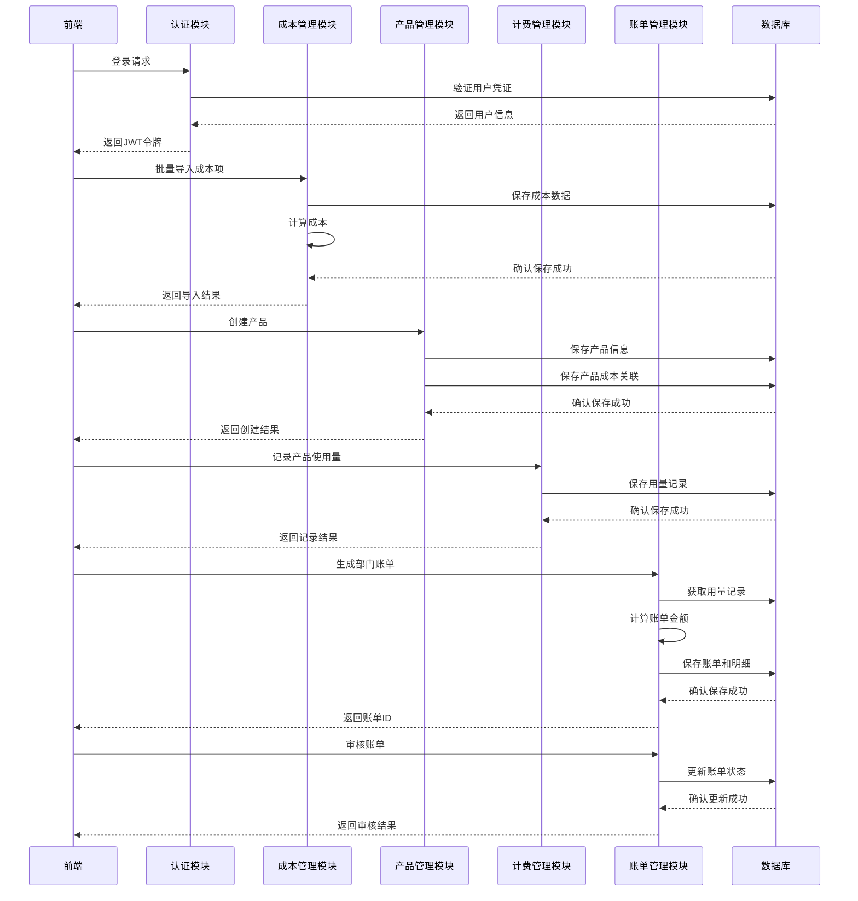
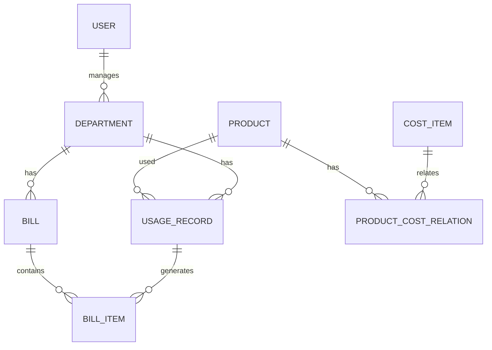

# FinOps后端系统架构设计文档

## 1. 系统架构概述

### 1.1 架构风格
- **架构类型**: 集成式单体应用 (Integrated Monolith)
- **模块划分**: 按功能域划分模块，包括认证、成本管理、产品管理、计费管理、账单管理和配置管理
- **技术栈**: Spring Boot 3.2 + MyBatis-Plus 3.5 + MySQL 8.0

### 1.2 核心流程图



## 2. 核心功能模块

### 2.1 认证模块
- **功能**: 用户认证、JWT令牌生成和验证
- **实现**: Spring Security + JWT
- **流程**: 登录验证 → 生成令牌 → 令牌验证 → 授权访问

### 2.2 成本管理模块
- **功能**: 成本项维护、批量导入、自动同步、成本计算
- **实现**: 基于Excel的批量导入、定时任务同步、成本计算引擎
- **流程**: 数据采集 → 成本计算 → 成本审核 → 成本发布

### 2.3 产品管理模块
- **功能**: 产品列表维护、成本项关联、定价公式设置
- **实现**: 产品成本关联表、定价公式解析器
- **流程**: 产品定义 → 成本项关联 → 定价设置 → 单价计算

### 2.4 计费管理模块
- **功能**: 用量记录、计量统计、单价计算
- **实现**: 用量记录表、批量导入接口
- **流程**: 用量记录 → 计量统计 → 单价计算 → 费用计算

### 2.5 账单管理模块
- **功能**: 部门账单生成、账单审核、账单分析
- **实现**: 账单生成引擎、事务管理
- **流程**: 账单生成 → 账单审核 → 账单发布 → 账单分析

### 2.6 配置管理模块
- **功能**: 成本模型配置、定价规则配置、系统参数配置
- **实现**: 配置表、配置缓存
- **流程**: 配置修改 → 配置保存 → 配置生效

## 3. 数据模型设计

### 3.1 核心数据表

| 表名 | 描述 | 关键字段 | 索引 |
|------|------|----------|------|
| users | 用户表 | id, username, password, role | username (唯一) |
| departments | 部门表 | id, name, code, manager_id | code (唯一) |
| cost_items | 成本项表 | id, name, category, unit_price, depreciation_months, quantity | category, cost_month |
| products | 产品表 | id, name, code, bottleneck_resource, pricing_formula | code (唯一) |
| product_cost_relations | 产品成本关联表 | id, product_id, cost_item_id, ratio | product_id |
| usage_records | 用量记录表 | id, product_id, department_id, amount, usage_date | usage_month, department_id |
| bills | 账单表 | id, department_id, month, total_amount, status | department_id, month (唯一) |
| bill_items | 账单明细表 | id, bill_id, product_id, amount, unit_price, subtotal | bill_id |
| configurations | 配置表 | id, key, value, description | key (唯一) |

### 3.2 数据关系



## 4. API接口设计

### 4.1 认证接口

| 接口路径 | 方法 | 功能描述 | 请求体 | 响应体 |
|----------|------|----------|--------|--------|
| /api/v1/auth/login | POST | 用户登录 | `{"username": "admin", "password": "123456"}` | `{"code": 200, "data": {"token": "...", "user": {...}}}` |

### 4.2 成本管理接口

| 接口路径 | 方法 | 功能描述 | 请求体 | 响应体 |
|----------|------|----------|--------|--------|
| /api/v1/cost/items | POST | 批量导入成本项 | `multipart/form-data` | `{"code": 200, "data": {"success": true, "count": 100}}` |
| /api/v1/cost/items/sync | POST | 自动同步成本项 | `{"system": "asset"}` | `{"code": 200, "data": {"success": true, "count": 50}}` |
| /api/v1/cost/items | GET | 获取成本项列表 | N/A | `{"code": 200, "data": [{"id": 1, "name": "...", ...}]}` |
| /api/v1/cost/calculate | POST | 计算成本 | `{"month": "2026-01"}` | `{"code": 200, "data": {"success": true}}` |

### 4.3 产品管理接口

| 接口路径 | 方法 | 功能描述 | 请求体 | 响应体 |
|----------|------|----------|--------|--------|
| /api/v1/products | POST | 添加产品 | `{"name": "...", "costItems": [...], "pricingFormula": "..."}` | `{"code": 200, "data": {"id": 1, "name": "..."}}` |
| /api/v1/products | GET | 获取产品列表 | N/A | `{"code": 200, "data": [{"id": 1, "name": "...", ...}]}` |
| /api/v1/products/{id} | GET | 获取产品详情 | N/A | `{"code": 200, "data": {"product": {...}, "costRelations": [...]}}` |
| /api/v1/products/calculate | POST | 计算产品单价 | `{"month": "2026-01"}` | `{"code": 200, "data": {"success": true}}` |

### 4.4 计费管理接口

| 接口路径 | 方法 | 功能描述 | 请求体 | 响应体 |
|----------|------|----------|--------|--------|
| /api/v1/usage | POST | 记录使用量 | `{"productId": 1, "departmentId": 1, "amount": 100}` | `{"code": 200, "data": {"id": 1}}` |
| /api/v1/usage/batch | POST | 批量记录使用量 | `[{"productId": 1, "departmentId": 1, "amount": 100}, ...]` | `{"code": 200, "data": {"success": true}}` |
| /api/v1/usage | GET | 获取使用量记录 | N/A | `{"code": 200, "data": [{"id": 1, "productId": 1, ...}]}` |

### 4.5 账单管理接口

| 接口路径 | 方法 | 功能描述 | 请求体 | 响应体 |
|----------|------|----------|--------|--------|
| /api/v1/bills | POST | 生成部门账单 | `{"month": "2026-01", "departmentId": 1}` | `{"code": 200, "data": {"billId": 1}}` |
| /api/v1/bills | GET | 获取账单列表 | N/A | `{"code": 200, "data": [{"id": 1, "departmentId": 1, ...}]}` |
| /api/v1/bills/{id} | GET | 获取账单详情 | N/A | `{"code": 200, "data": {"bill": {...}, "items": [...]}}` |
| /api/v1/bills/{id}/approve | POST | 审核账单 | `{"approverId": 1}` | `{"code": 200, "data": {"success": true}}` |

### 4.6 配置管理接口

| 接口路径 | 方法 | 功能描述 | 请求体 | 响应体 |
|----------|------|----------|--------|--------|
| /api/v1/config/{key} | GET | 获取配置值 | N/A | `{"code": 200, "data": {"key": "...", "value": "..."}}` |
| /api/v1/config/{key} | PUT | 更新配置值 | `{"value": "..."}` | `{"code": 200, "data": {"success": true}}` |

## 5. 核心技术实现

### 5.1 成本计算引擎

- **功能**: 自动计算折旧、公摊比例、公摊后成本
- **算法**:
  - 折旧月价 = 单价 / 折旧月限
  - 月成本 = 折旧月价 × 数量
  - 公摊比例 = 某成本项成本 / 成本大类中所有成本项成本总和
  - 非公摊成本项月总成本 = 非公摊成本项月成本 + 各项公摊成本总和 × 公摊比例

- **实现代码**:
  ```java
  public boolean calculateCost(String month) {
      List<CostItem> costItems = getByMonth(month);
      if (costItems.isEmpty()) return false;

      // 计算折旧月价和月成本
      for (CostItem item : costItems) {
          BigDecimal depreciationMonthlyPrice = item.getUnitPrice()
                  .divide(new BigDecimal(item.getDepreciationMonths()), 2, BigDecimal.ROUND_HALF_UP);
          item.setDepreciationMonthlyPrice(depreciationMonthlyPrice);

          BigDecimal monthlyCost = depreciationMonthlyPrice.multiply(new BigDecimal(item.getQuantity()));
          item.setMonthlyCost(monthlyCost);
          item.setUpdatedTime(LocalDateTime.now());
      }

      // 计算公摊比例和公摊后成本
      calculateShareRatio(costItems);

      return updateBatchById(costItems);
  }
  ```

### 5.2 账单生成引擎

- **功能**: 根据用量和单价生成部门账单
- **实现**:
  - 获取部门当月的用量记录
  - 按产品分组计算费用
  - 创建账单和明细记录
  - 计算总金额并保存

- **实现代码**:
  ```java
  @Transactional
  public Long generateDepartmentBill(String month, Long departmentId) {
      // 获取部门当月的用量记录
      List<UsageRecord> usageRecords = usageRecordService.getByMonthAndDepartment(month, departmentId);
      if (usageRecords.isEmpty()) return null;

      // 创建账单
      Bill bill = new Bill();
      bill.setDepartmentId(departmentId);
      bill.setMonth(month);
      bill.setStatus("待审核");
      bill.setCreatedTime(LocalDateTime.now());
      bill.setUpdatedTime(LocalDateTime.now());

      // 计算总金额并保存账单
      BigDecimal totalAmount = calculateBillItems(bill, usageRecords);
      bill.setTotalAmount(totalAmount);
      save(bill);

      return bill.getId();
  }
  ```

### 5.3 JWT认证机制

- **功能**: 实现无状态的用户认证
- **实现**:
  - 登录时生成JWT令牌
  - 请求时验证令牌
  - 基于令牌的权限控制

- **实现代码**:
  ```java
  public static String generateToken(Long userId, String username, String role) {
      Date now = new Date();
      Date expiration = new Date(now.getTime() + EXPIRATION_TIME);

      return Jwts.builder()
              .setSubject(username)
              .claim("userId", userId)
              .claim("role", role)
              .setIssuedAt(now)
              .setExpiration(expiration)
              .signWith(SECRET_KEY)
              .compact();
  }
  ```

### 5.4 批量导入功能

- **功能**: 支持Excel批量导入成本项和用量记录
- **实现**:
  - 使用Apache POI解析Excel文件
  - 批量保存数据到数据库
  - 提供导入结果反馈

- **实现代码**:
  ```java
  public boolean batchImport(MultipartFile file) {
      try (InputStream inputStream = file.getInputStream();
           Workbook workbook = new XSSFWorkbook(inputStream)) {

          Sheet sheet = workbook.getSheetAt(0);
          List<CostItem> costItems = new ArrayList<>();

          for (int i = 1; i <= sheet.getLastRowNum(); i++) {
              Row row = sheet.getRow(i);
              if (row == null) continue;

              CostItem costItem = new CostItem();
              costItem.setName(getCellValue(row.getCell(0)));
              costItem.setCategory(getCellValue(row.getCell(1)));
              // ... 其他字段赋值
              costItems.add(costItem);
          }

          return saveBatch(costItems);
      } catch (Exception e) {
          e.printStackTrace();
          return false;
      }
  }
  ```

## 6. 部署与集成方案

### 6.1 部署架构

- **开发环境**: 本地开发机器 + MySQL本地实例
- **测试环境**: 测试服务器 + 测试数据库实例
- **生产环境**: 生产服务器集群 + 主从数据库架构

### 6.2 集成方案

- **前端集成**: 通过RESTful API与前端Vue应用集成
- **资产系统集成**: 通过定时任务自动同步资产数据
- **财务系统集成**: 支持导出财务数据到ERP系统
- **监控系统集成**: 提供API接口获取使用量数据

### 6.3 数据同步策略

- **实时同步**: 核心操作（如保存成本项、记录使用量）实时写入数据库
- **批量同步**: 非核心操作（如资产数据同步）通过定时任务批量处理
- **异常处理**: 同步失败时自动重试，重试失败后记录错误日志并发送告警

## 7. 性能与安全

### 7.1 性能优化

- **数据库优化**:
  - 合理设计索引，覆盖95%查询
  - 使用批量操作减少数据库连接次数
  - 优化SQL查询，避免全表扫描

- **缓存优化**:
  - 使用Redis缓存热点数据
  - 缓存配置信息和计算结果
  - 实现缓存过期策略

- **计算优化**:
  - 成本计算使用批量处理
  - 账单生成使用多线程并行处理
  - 复杂计算采用异步处理

### 7.2 安全措施

- **认证与授权**:
  - 使用JWT进行身份认证
  - 基于角色的权限控制
  - 密码加密存储

- **数据安全**:
  - 敏感数据加密传输
  - 数据库连接使用SSL
  - 定期数据备份

- **接口安全**:
  - 实现请求参数验证
  - 防止SQL注入攻击
  - 防止XSS攻击
  - 限制API访问频率

## 8. 监控与维护

### 8.1 监控指标

- **系统指标**:
  - CPU使用率
  - 内存使用率
  - 磁盘空间
  - 网络带宽

- **应用指标**:
  - API响应时间
  - 请求处理量
  - 错误率
  - 数据库连接池状态

- **业务指标**:
  - 成本计算完成率
  - 账单生成成功率
  - 数据同步成功率

### 8.2 日志管理

- **日志级别**:
  - ERROR: 错误信息
  - WARN: 警告信息
  - INFO: 信息性消息
  - DEBUG: 调试信息

- **日志格式**:
  - 包含时间戳、级别、模块、消息内容
  - 错误日志包含堆栈信息
  - 关键操作记录详细日志

- **日志存储**:
  - 本地文件存储
  - 集中式日志管理（如ELK）
  - 日志保留期配置

### 8.3 故障处理

- **故障检测**:
  - 健康检查接口
  - 异常监控
  - 告警机制

- **故障恢复**:
  - 自动重启机制
  - 数据恢复策略
  - 灾备方案

- **故障分析**:
  - 日志分析
  - 性能分析
  - 根因定位

## 9. 总结与亮点

### 9.1 系统亮点

1. **全流程覆盖**: 从成本管理到账单生成的完整流程
2. **自动化处理**: 自动计算成本、生成账单，减少手动操作
3. **灵活配置**: 支持自定义定价公式、成本模型配置
4. **高性能设计**: 批量处理、异步计算、缓存优化
5. **安全可靠**: 完善的认证授权、数据安全措施
6. **易于集成**: 标准RESTful API，支持与其他系统集成

### 9.2 技术创新

1. **成本计算引擎**: 实现复杂的成本计算逻辑，支持折旧和公摊计算
2. **账单生成引擎**: 高效生成部门账单，确保账单准确性
3. **JWT认证机制**: 实现无状态认证，提高系统可扩展性
4. **批量导入功能**: 支持Excel批量导入，提高数据录入效率
5. **自动同步机制**: 从资产系统自动同步数据，减少人工干预

### 9.3 业务价值

1. **成本透明化**: 实现从资产到成本到定价到账单的全链路追踪
2. **账单准确性**: 确保各部门账单总和与实际成本持平
3. **决策支持**: 为资源优化和定价策略提供数据支撑
4. **流程自动化**: 减少手动操作，提高运维效率
5. **成本优化**: 通过数据分析发现成本优化机会

## 10. 未来规划

### 10.1 功能扩展

- **预算管理**: 支持部门预算设置和监控
- **成本预测**: 基于历史数据预测未来成本
- **多维度分析**: 支持按项目、用户等维度分析成本
- **智能推荐**: 基于使用模式推荐成本优化方案

### 10.2 技术演进

- **微服务架构**: 逐步拆分为微服务，提高系统可扩展性
- **容器化部署**: 使用Docker和Kubernetes实现容器化部署
- **云原生**: 支持云环境部署，实现弹性伸缩
- **AI集成**: 引入AI技术优化成本预测和分析

### 10.3 生态建设

- **开放API**: 提供开放API，支持第三方系统集成
- **插件机制**: 实现插件化架构，支持功能扩展
- **社区贡献**: 鼓励社区贡献，共同完善系统

## 11. 结论

FinOps后端系统采用先进的技术架构和设计理念，实现了从成本管理到账单生成的完整业务流程。系统具有高性能、高可靠性、易于扩展等特点，能够满足企业级中后台系统的需求。通过自动化处理和智能分析，系统能够帮助企业提高成本透明度、优化资源配置、降低运营成本，实现财务运营的数字化转型。

---

**文档版本**: v1.0
**编制日期**: 2026-01-30
**编制人**: 全栈产品专家
**审核人**: 待审核
