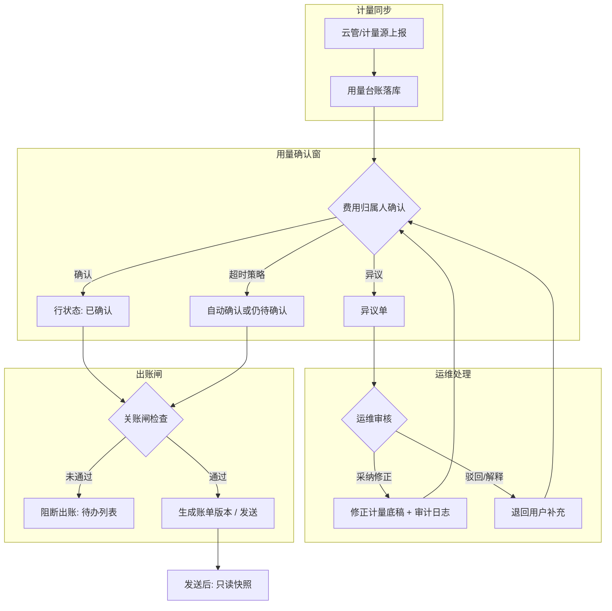

# 用量管理页面设计说明（运维修正 + 用户查看与异议进展）

**文档日期**：2026-05-12  
**版本**：v0.1  
**状态**：设计稿（待评审）

---

## 1. 文档信息

| 项 | 内容 |
|----|------|
| 名称 | 用量管理页面设计说明（运维修正 + 用户查看与异议进展） |
| 版本 | v0.1 |
| 依据 | 出账流程（Visio 提炼）、PUML 出账节点、FinOps 操作流程主流程、账单定稿规格、现有 `usage-management.html` / 用量确认原型 |
| 范围 | 信息架构、角色权限、关键流程、数据与状态、与出账闸联动；不含具体接口字段表（可在实现前补） |

---

## 2. 出账流程图（对齐项目内共识）

### 2.1 业务阶段（来自 `出账流程.vsdx` 提炼）

1. **次月 1 日**：系统自动推送**用量确认**通知（可与企微等渠道联动，见 `usage-confirm-wecom-push-settings.html` 思路）。
2. **用量确认窗**：费用归属人核对系统计量；**7 个工作日无操作**是否自动确认由**租户策略**决定（账单规格默认倾向**不自动**，避免无确认出账；若业务强制自动，须在配置中显式打开并审计）。
3. **异议路径**：用户提交异议 → **运维管理员**处理（修正计量数据 / 解释并退回）→ 闭环后再进入后续阶段。
4. **成本与定价侧**：成本确认、FinOps 待办校验（定价单、成本池、SKU 关联完整等，见定价页「出账就绪」）→ **通过关账闸**后系统出账。
5. **出账与关账**：在约定时点（规格示例：**N 月 10 日 00:00** 出具并发送 **N−1 月**账单）生成账单版本；**发送完成后**用量与金额等**一律只读**，纠错走**新版本重跑**而非原位改数。

### 2.2 与架构图的关系（`finops_parallel_flow.puml` 等）

- 节点 **31–33**：出账日前校验**定价单是否已生成**；**出账日**按**最新版定价单**做计量计费并出账单。
- 节点 **34–36**：次月展示上月成本/定价**草稿**，运维修正后**发布确认定价单**。

**说明**：**用量管理**聚焦「计量底稿 + 确认 + 异议」；**定价/成本就绪**仍属定价域，但用量页须展示**阻断出账原因**的摘要链接（避免管理员不知道卡在哪）。

### 2.3 主流程串联（Mermaid）

---

## 3. 设计目标

| 目标 | 说明 |
|------|------|
| G1 | **运维管理员**可在关账前对计量底稿做**受控修正**（含异议采纳后的批量/单行修正），全程**可审计**。 |
| G2 | **费用归属人**可查看本人或本部门范围内的计量明细与异议进度；**部门负责人**可查看所辖组织及下级部门数据（只读）；**运维**全量可见。 |
| G3 | 与**出账闸**一致：未满足确认/异议闭环时，页面与账单域**统一展示阻断原因**，避免「用量页全绿但账单仍不出」的割裂。 |
| G4 | 与**发送后只读**一致：关账发送后，用量管理进入**历史只读**模式；修正需求引导至「冲补/新版本」说明入口（不在用量页原位改已发送账期）。 |

---

## 4. 角色与权限（RBAC 概要）

| 能力 | 运维管理员 | 费用归属人/部门用户 | 财务只读 | 系统 |
|------|------------|---------------------|----------|------|
| 查看计量明细（本租户数据范围） | 全部（可配置组织范围） | 本人或授权部门/项目 | 可配置 | — |
| 单行确认 / 批量确认 | 可代理（可选，默认仅归属人） | 本人 | 否 | 超时策略 |
| 发起异议 | 否 | 是 | 否 | — |
| 处理异议、修正计量 | 是 | 否 | 否 | — |
| 导出用量报表（CSV/Excel） | 是 | 策略控制（脱敏） | 可配置 | — |
| 关账后修改 | 否（仅冲补流程） | 否 | 否 | 冻结 |

**字段级**：修正须记录 `old_value / new_value / reason / ticket_id / operator / time / source`（来源：异议单号或「运维直接勘误」）。

---

## 5. 信息架构（页面结构）

在现有 `usage-management.html` 思路上**收敛为双入口、一套数据**（避免五 Tab 全堆给两类用户）：

### 5.1 顶层

- **账期选择器**（必选）+ **数据版本/同步批次**（可选，用于「计量源重传」对账）。
- **阶段条**（与出账流程一致）：`计量同步 → 用量确认 → 异议处理 → 出账就绪校验 → 已关账`；当前步骤高亮，**阻断点**红色提示。
- **全局通知条**：当前账期截止时刻、待确认条数、待处理异议条数（与 `bill-management.html` 中「出账日前须完成确认」文案一致）。

### 5.2 Tab 或子路由（建议）

| 模块 | 主要受众 | 内容 |
|------|----------|------|
| **用量工作台** | 运维为主 | 待办：待同步异常、待处理异议、高风险差异、未确认 Top N；快捷跳转修正。 |
| **用量明细** | 双方 | 多维筛选（部门、项目、资源、计量项、状态）；列表 + 下钻抽屉；运维可见「修正」入口。 |
| **异议中心** | 用户发起 / 运维处理 | 列表 + 状态；用户侧强调**进度时间线**；运维侧强调**处理动作**（采纳/驳回/需补充材料）。 |
| **出账联动** | 运维为主 | 只读聚合：定价就绪、成本池待办、关闸检查结果；链到定价管理、账单管理。 |
| **审计与导出** | 运维 / 合规 | 修正日志、确认日志、导出任务队列。 |

**用户默认落地页**：`用量明细`（我的待确认置顶）+ `异议中心`（我的工单）。  
**运维默认落地页**：`用量工作台`。

---

## 6. 关键交互场景

### 6.1 用户：查看计量

- 列表列建议：`资源标识、服务类型、计量项、系统计量值、统计区间、费用归属人、确认状态、异议状态、最后更新时间`。
- **确认状态**（用量行）仅 **待确认 / 已确认** 两档；**异议进度**在异议中心展示，不占用确认状态枚举（见 `finops-usage-billing-workflow.mdc` §4）。
- 下钻抽屉：**原始上报片段**（可选：来自哪次同步）、**计费所用换算**（如小时化规则）、**与展示口径一致的说明链接**。
- **关账后**：抽屉顶部固定条「本账期已关账，数据为只读快照」。

### 6.2 用户：确认与异议

- **确认**：单行 / 批量；二次确认文案含截止时刻。
- **异议**：表单字段建议：`类型（偏高/偏低/归属错误/源数据缺失等）、说明、附件、期望修正值（可选）、关联计量行 ID`；提交后生成 `DIS-xxx` 工单。
- **进展**：时间线节点示例：`已提交 → 待运维受理 → 处理中 → 已采纳修正 / 已驳回（原因）→ 待用户补充 → 结束`；与企微推送可共用同一套状态枚举。

### 6.3 运维：修正计量

- **入口**：从异议单「采纳」进入预填修正；或从用量明细「勘误」进入（须填原因码）。
- **校验**：修正不得破坏主键与时间区间完整性；若修正影响已汇总聚合，触发**异步重算**提示（本账期未发送才可写）。
- **采纳异议**：写入新计量值 → 自动重算该行衍生字段（若系统有试算金额可展示「影响预览」，可选 P1）。

### 6.4 运维：批量操作

- 批量确认（代理模式若开启）、批量导出、批量标记「源数据待云管补传」（与计量源协同）。

---

## 7. 数据与状态机（概念）

- **用量行 `UsageLine`**：`PENDING_CONFIRM | CONFIRMED | DISPUTE_OPEN | DISPUTE_RESOLVED | LOCKED`（关账后 `LOCKED`）。
- **异议单 `Dispute`**：`SUBMITTED | TRIAGING | IN_PROGRESS | ACCEPTED | REJECTED | CLOSED`。
- **与账单**：仅在 `BillPeriod` 未发送且关闸通过时，`UsageLine` 可写；发送后行级与 `BillVersion` 快照对齐只读。

---

## 8. 与相关模块的边界

| 模块 | 边界 |
|------|------|
| 用量确认 PC/移动页 | 可复用同一套状态 API；用量管理侧重**台账级运维**与**异议闭环**，确认页侧重**终端确认体验**。 |
| 账单管理 | 出账闸、发送时点、只读规则以账单规格为准；用量页不重复维护账单金额编辑。 |
| 定价管理 | 「出账就绪」待办只在联动区展示摘要 + deep link。 |
| 计量管理 v2（`企业私有云...计量管理页面需求文档`） | 若保留独立「计量运营大屏」，用量管理可定位为**账期导向的关账协同**；避免两页字段口径冲突，共用字典服务。 |

---

## 9. 非功能需求（摘录）

- **审计**：所有修正与确认写不可篡改日志（或 WORM 存储策略由平台定）。
- **性能**：大租户列表默认服务端分页 + 异步导出。
- **幂等**：计量源重复上报按 `source_event_id` 去重。
- **国际化**：若仅中文环境，可后置 i18n。

---

## 10. 验收要点（建议作为 UAT 清单）

1. 关闸未通过时，首页/工作台与账单页**阻断原因一致**。
2. 异议从提交到采纳，用量行状态与**时间线**一致；采纳后**旧值可追溯**。
3. 模拟发送完成：用量行**不可再改**，UI 无「修正」入口或灰显并给出去向说明。
4. 运维与普通用户**菜单与按钮**符合 RBAC。
5. 导出文件含账期、导出时间、操作人水印（可选）。

---

## 11. 关联文件（仓库内）

- 原型：`usage-management.html`、用量确认相关 HTML、账单 `bill-management.html`
- 规格：`docs/superpowers/specs/2026-05-08-bill-management-drilldown-design.md`
- 流程：`FinOps操作流程文档.md`、`finops_parallel_flow.puml`、`finops_asset_flow_v2.puml`
- 提炼记录：`.workbuddy/memory/2026-05-11.md`（出账流程 Visio 要点）
